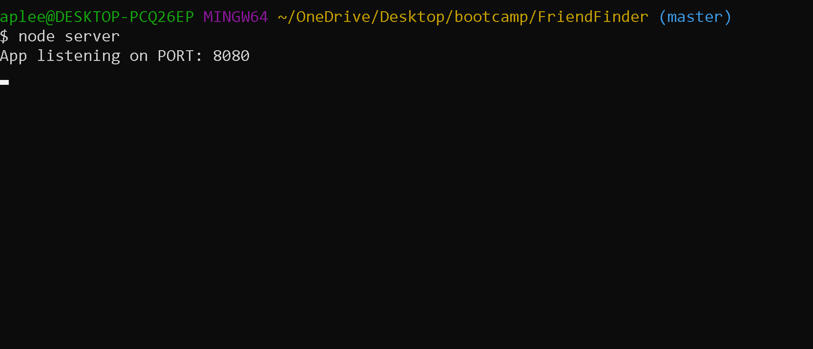

# FriendFinder

## Overview
A compatibility-based "FriendFinder" application -- basically a dating app. This full-stack site will take in results from users' surveys, then compare their answers with those from other users. The app will then display the name and picture of the user with the best overall match.   Express will be used to handle routing. 

## Setup
### To use this application locally:
1) If you haven't already clone this repository to your computer
2) If you haven't already installed node navigate to their site and install the version noted as "Recommended for Most Users": https://nodejs.org/en/
3) Using your terminal: cd to the root of the directory and install the node dependencies using command -- $ npm i 
4) Run the following in your command line: $ node server
5) Command line should read: "App listening on port: 8080"
6) Open a browser and navigate to: http://localhost:8080
7) Follow the instructions and survey link to "find a friend!" 

#### Detailed list of command line codes for getting started locally: 

    $ git clone https://github.com/apleek3/FriendFinder
    $ cd --your file path--../FriendFinder
    $ npm i
    $ node server
    App listening on port: 8080
    _

### To use the deployed version of the application use the following link:
[FriendFinder](https://friend-finder-apleek3.herokuapp.com/)

